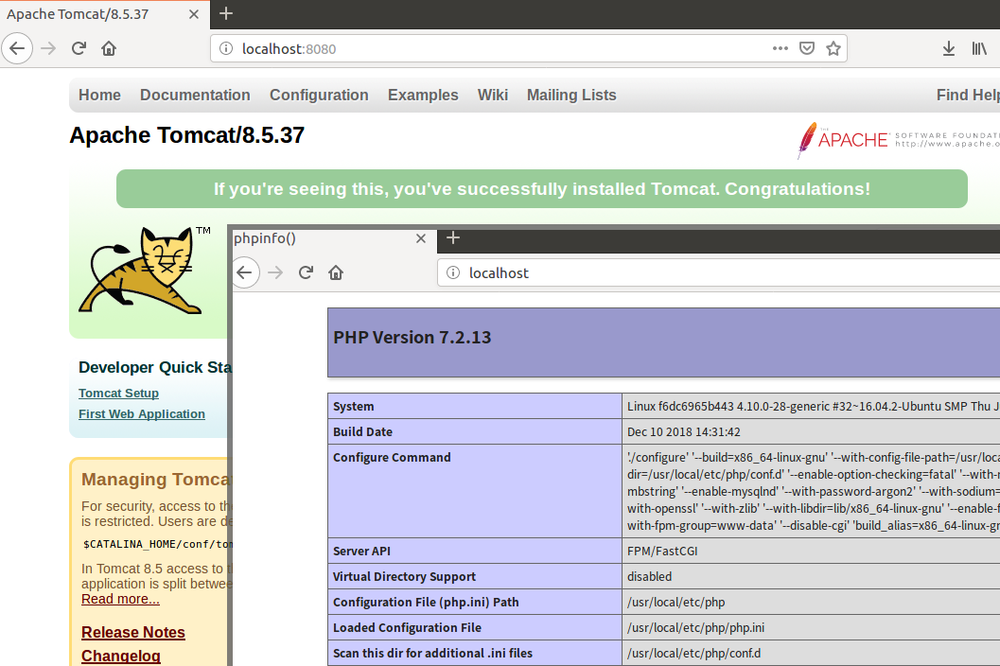
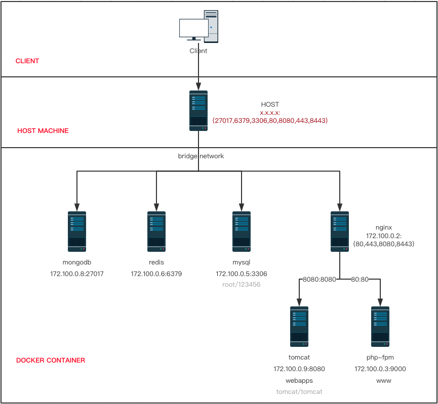

# Quick setup development environment with docker


## Quick Start

```
$ git clone https://github.com/fanfq/compose_dev.git
$ cd compose_dev
$ docker-compose up -d
```

## Usage

```
PHP WEB APP ACCESS
http://localhost
https://localhost:443

JAVA WAR APP ACCESS
http://localhost:8080
https://localhost:8443

MYSQL
mysql localhost:3306 -uroot -p123456

MONGO
localhost:27017

REDIS
localhost:6379
```



## Include

- [x] nginx:latest
- [x] tomcat:8.5 
- [x] php:5.6
- [x] php:7.2
- [x] mysql:5.7
- [x] mongo:latest
- [x] redis:latest

## File Tree
```
.
├── .env //network conf files
├── conf //about conf files
├── docker-compose.yml //compose file
├── LICENSE
├── log //about logs
├── mongo //mongo storage
├── mysql //mysql storage
├── php //php-fpm Dockerfile
├── README.md
├── redis //redis storage
├── webapps //.war project 
└── www //.php project 
```

## Network Topology 



## Distribute Project

put the php project under the `./www/`

put the java war project under the `./webapps/`

## Config

the `important` config as below 


**nginx**

global config

`./conf/nginx/nginx.conf`

java war config(port:8080/8443)

`./conf/nginx/conf.d/webapp.conf`

php config(port:80/443)

`./conf/nginx/conf.d/www.conf`

**tomcat**

`./conf/tomcat/85/tomcat-user.xml`

```xml
//localhost:8080 can be login with tomcat/tomcat user

<role rolename="admin-gui"/>
<role rolename="manager-script"/>
<role rolename="manager-jmx"/>
<role rolename="manager-status"/>
<role rolename="manager-gui"/>
<user username="tomcat" password="tomcat" roles="manager-status,manager-jmx,manager-script,admin-gui,manager-gui"/>
```

`./conf/tomcat/85/server.xml`

```
//updated maxPostSize="52428800"
<Connector port="8080" protocol="HTTP/1.1"
               connectionTimeout="20000"
               redirectPort="8443" maxPostSize="52428800"/>

//updated support Nginx X-Real-IP in logfile
//[25/Dec/2018:22:50:11 +0800] 192.168.31.198 173.100.2.100 173.100.2.3 - -  "GET /cluster/ HTTP/1.0" 200 462 35
//|time|Real-IP | NGINX Host | tomcat ip | ... | result |response size| ms|
<Valve className="org.apache.catalina.valves.AccessLogValve" directory="logs"
               prefix="localhost_access_log" suffix=".txt"
               pattern="%t %{X-Real-IP}i %h %A %l %u &quot;%r&quot; %s %b %D" resolveHosts="false"/>
```               


